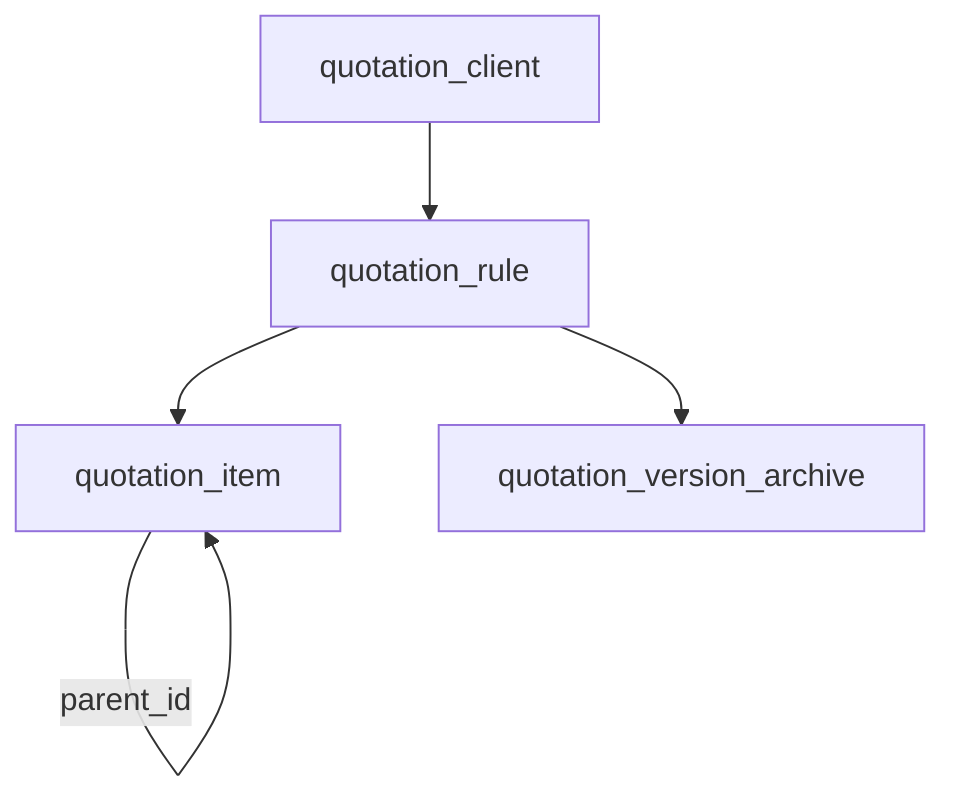
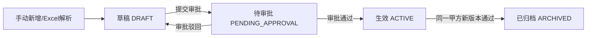

# 报价 Agent 技术设计文档

## 一、改动概览

| 文件 | 操作 | 说明 |
|------|------|------|
| `app/models/quotation.py` | 新建 | Client / QuotationRule / QuotationItem / VersionArchive 四个模型 |
| `app/models/enums.py` | 修改 | 新增 `QuotationRuleStatus` / `RuleSourceType` 枚举 |
| `app/models/__init__.py` | 修改 | 注册新模型 |
| `app/schemas/quotation.py` | 新建 | Pydantic 请求/响应 Schema |
| `app/controllers/quotation.py` | 新建 | 甲方 / 报价规则 / 审批 CRUD 控制器 |
| `app/services/quotation_service.py` | 新建 | 报价规则核心业务逻辑（版本管理、审批流转、Excel解析） |
| `app/services/excel_parser.py` | 新建 | Excel 报价单解析服务 |
| `app/api/v1/quotation/__init__.py` | 新建 | 路由注册 |
| `app/api/v1/quotation/quotation.py` | 新建 | 报价模块 REST API |
| `app/agents/tools/quotation_rule_tool.py` | 新建 | Agent Tool: `get_quotation_rule` |
| `migrations/models/` | 新建 | 数据库迁移文件 |
| `scripts/init_quotation_menus.py` | 新建 | 菜单初始化脚本 |

---

## 二、数据模型设计

### 2.1 枚举定义

**文件**：`app/models/enums.py` 新增

```python
class QuotationRuleStatus(StrEnum):
    """报价规则状态"""
    DRAFT = "draft"               # 草稿
    PENDING_APPROVAL = "pending_approval"  # 待审批
    ACTIVE = "active"             # 生效中
    ARCHIVED = "archived"         # 已归档


class RuleSourceType(StrEnum):
    """规则来源"""
    MANUAL = "manual"            # 手动录入
    EXCEL_IMPORT = "excel_import"  # Excel 导入
```

### 2.2 ORM 模型

**新建文件**：`app/models/quotation.py`

```python
from tortoise import fields
from .base import BaseModel, TimestampMixin
from .enums import QuotationRuleStatus, RuleSourceType


class Client(BaseModel, TimestampMixin):
    """甲方 — 报价规则归属主体"""
    name = fields.CharField(max_length=200, unique=True, description="甲方名称")
    short_name = fields.CharField(max_length=100, null=True, description="甲方简称", index=True)
    contact = fields.CharField(max_length=100, null=True, description="联系人")
    phone = fields.CharField(max_length=50, null=True, description="联系电话")
    remark = fields.TextField(null=True, description="备注")
    is_active = fields.BooleanField(default=True, description="是否启用", index=True)
    is_deleted = fields.BooleanField(default=False, description="是否已删除", db_index=True)

    class Meta:
        table = "quotation_client"


class QuotationRule(BaseModel, TimestampMixin):
    """报价规则 — 归属某甲方的完整报价方案"""
    client_id = fields.IntField(description="甲方ID -> quotation_client.id", index=True)
    version = fields.IntField(default=1, description="版本号")
    status = fields.CharEnumField(
        QuotationRuleStatus, default=QuotationRuleStatus.DRAFT, description="状态"
    )
    source_type = fields.CharEnumField(
        RuleSourceType, default=RuleSourceType.MANUAL, description="来源类型"
    )
    creator_id = fields.IntField(description="创建人ID -> user.id", index=True)
    approver_id = fields.IntField(null=True, description="实际审批人ID -> user.id")
    approved_at = fields.DatetimeField(null=True, description="审批通过时间")
    reject_reason = fields.TextField(null=True, description="驳回原因")
    remark = fields.TextField(null=True, description="备注")
    is_deleted = fields.BooleanField(default=False, description="是否已删除", db_index=True)

    class Meta:
        table = "quotation_rule"
        # 同一甲方 + 版本号唯一
        unique_together = (("client_id", "version"),)


class QuotationItem(BaseModel, TimestampMixin):
    """报价明细 — 一级/二级层级结构"""
    rule_id = fields.IntField(description="报价规则ID -> quotation_rule.id", index=True)
    parent_id = fields.IntField(null=True, description="父级明细ID(null=一级项目)", index=True)
    name = fields.CharField(max_length=200, description="项目名称")
    code = fields.CharField(max_length=100, null=True, description="项目编码")
    unit_price = fields.DecimalField(max_digits=12, decimal_places=4, null=True, description="单价")
    unit = fields.CharField(max_length=50, null=True, description="单位(元/次、元/人天等)")
    remark = fields.TextField(null=True, description="备注")
    sort_order = fields.IntField(default=0, description="排序号")
    is_deleted = fields.BooleanField(default=False, description="是否已删除", db_index=True)

    class Meta:
        table = "quotation_item"


class VersionArchive(BaseModel, TimestampMixin):
    """版本归档 — 旧版本完整 JSON 快照，永久保留"""
    client_id = fields.IntField(description="甲方ID -> quotation_client.id", index=True)
    rule_id = fields.IntField(description="原规则ID -> quotation_rule.id", index=True)
    version = fields.IntField(description="归档版本号")
    snapshot = fields.JSONField(description="完整规则快照(含所有明细)")
    archived_reason = fields.CharField(max_length=100, description="归档原因: new_version/reimport")
    archived_by = fields.IntField(description="触发归档的用户ID", index=True)

    class Meta:
        table = "quotation_version_archive"
```

### 2.3 ER 关系图



### 2.4 审批人配置

审批人通过 `GlobalConfig` 表配置（复用现有全局配置机制），配置项：

| config_key | 示例值 | 说明 |
|-----------|--------|------|
| `quotation_approver_ids` | `[1, 5]` | 有权审批的用户ID列表（1~2人） |

提交审批时系统自动通知配置的审批人（后续可对接飞书消息），审批操作仅校验当前用户是否在该列表中。

### 2.5 数据库迁移

新建迁移文件 `migrations/models/5_2026xxxx_quotation.py`，使用 `aerich.exe migrate --name quotation` 生成。

---

## 三、Schemas（数据契约）

**新建文件**：`app/schemas/quotation.py`

```python
from datetime import datetime
from decimal import Decimal
from typing import Optional

from pydantic import BaseModel, Field


# ── 甲方 ──────────────────────────────────────────────────────────

class ClientCreate(BaseModel):
    name: str = Field(..., max_length=200, description="甲方名称")
    short_name: Optional[str] = Field(None, max_length=100, description="甲方简称")
    contact: Optional[str] = Field(None, description="联系人")
    phone: Optional[str] = Field(None, description="联系电话")
    remark: Optional[str] = Field(None, description="备注")


class ClientUpdate(BaseModel):
    name: Optional[str] = Field(None, max_length=200)
    short_name: Optional[str] = Field(None, max_length=100)
    contact: Optional[str] = None
    phone: Optional[str] = None
    remark: Optional[str] = None
    is_active: Optional[bool] = None


# ── 报价明细 ─────────────────────────────────────────────────────

class QuotationItemCreate(BaseModel):
    parent_id: Optional[int] = Field(None, description="父级ID(null=一级)")
    name: str = Field(..., max_length=200, description="项目名称")
    code: Optional[str] = Field(None, max_length=100, description="项目编码")
    unit_price: Optional[Decimal] = Field(None, description="单价")
    unit: Optional[str] = Field(None, max_length=50, description="单位")
    remark: Optional[str] = None
    sort_order: int = Field(0, description="排序号")


class QuotationItemUpdate(BaseModel):
    name: Optional[str] = Field(None, max_length=200)
    code: Optional[str] = None
    unit_price: Optional[Decimal] = None
    unit: Optional[str] = None
    remark: Optional[str] = None
    sort_order: Optional[int] = None


# ── 报价规则 ─────────────────────────────────────────────────────

class QuotationRuleCreate(BaseModel):
    client_id: int = Field(..., description="甲方ID")
    source_type: str = Field("manual", description="来源: manual/excel_import")
    items: list[QuotationItemCreate] = Field(default_factory=list, description="明细列表")
    remark: Optional[str] = None


class QuotationRuleSubmit(BaseModel):
    """提交审批"""
    rule_id: int = Field(..., description="规则ID")


# ── 审批 ─────────────────────────────────────────────────────────

class ApprovalAction(BaseModel):
    rule_id: int = Field(..., description="规则ID")
    action: str = Field(..., description="approve/reject")
    comment: Optional[str] = Field(None, description="审批意见(驳回时必填)")


# ── Excel 导入 ────────────────────────────────────────────────────

class ExcelParseResult(BaseModel):
    """Excel 解析结果"""
    items: list[QuotationItemCreate] = Field(..., description="解析到的明细列表")
    warnings: list[str] = Field(default_factory=list, description="待确认项说明")
```

---

## 四、Controller 层

**新建文件**：`app/controllers/quotation.py`

```python
from tortoise.expressions import Q

from app.core.crud import CRUDBase
from app.models.quotation import (
    Client, QuotationItem, QuotationRule, VersionArchive,
)
from app.schemas.quotation import ClientCreate, ClientUpdate


class ClientController(CRUDBase[Client, ClientCreate, ClientUpdate]):
    def __init__(self):
        super().__init__(model=Client)

    async def get_by_name(self, name: str):
        """精确匹配甲方名称"""
        return await self.model.filter(name=name, is_deleted=False).first()

    async def search_by_keyword(self, keyword: str, limit: int = 10):
        """模糊匹配甲方"""
        return await self.model.filter(
            Q(name__icontains=keyword) | Q(short_name__icontains=keyword),
            is_deleted=False,
        ).limit(limit)


class QuotationRuleController(CRUDBase[QuotationRule, dict, dict]):
    def __init__(self):
        super().__init__(model=QuotationRule)

    async def get_active_rule(self, client_id: int):
        """获取甲方当前生效规则"""
        return await self.model.filter(
            client_id=client_id, status="active", is_deleted=False
        ).first()

    async def get_next_version(self, client_id: int) -> int:
        """获取甲方下一个版本号"""
        last = await self.model.filter(
            client_id=client_id, is_deleted=False
        ).order_by("-version").first()
        return (last.version + 1) if last else 1


class QuotationItemController(CRUDBase[QuotationItem, dict, dict]):
    def __init__(self):
        super().__init__(model=QuotationItem)

    async def get_tree_by_rule(self, rule_id: int) -> list[dict]:
        """获取规则下的明细树（一级 → 二级）"""
        items = await self.model.filter(rule_id=rule_id, is_deleted=False).order_by("sort_order")
        top_items = [i for i in items if i.parent_id is None]
        result = []
        for top in top_items:
            d = await top.to_dict()
            d["children"] = [
                await child.to_dict()
                for child in items if child.parent_id == top.id
            ]
            result.append(d)
        return result


client_controller = ClientController()
quotation_rule_controller = QuotationRuleController()
quotation_item_controller = QuotationItemController()
```

> **说明**：审批流程简化后不再需要独立的 ApprovalController，审批状态直接记录在 `QuotationRule` 的 `approver_id` / `approved_at` / `reject_reason` 字段上。

---

## 五、Service 层 — 核心业务逻辑

### 5.1 报价规则服务

**新建文件**：`app/services/quotation_service.py`

```python
import json
import logging
from datetime import datetime
from typing import Optional

from app.controllers.quotation import (
    client_controller, quotation_item_controller, quotation_rule_controller,
)
from app.models.enums import QuotationRuleStatus
from app.models.quotation import QuotationItem, QuotationRule, VersionArchive
from app.models.global_config import GlobalConfig

logger = logging.getLogger(__name__)


class QuotationService:

    async def create_rule(
        self, client_id: int, creator_id: int, items: list[dict], source_type: str = "manual"
    ) -> QuotationRule:
        """新建报价规则（草稿状态）"""
        version = await quotation_rule_controller.get_next_version(client_id)
        rule = await QuotationRule.create(
            client_id=client_id,
            version=version,
            status=QuotationRuleStatus.DRAFT,
            source_type=source_type,
            creator_id=creator_id,
        )
        await self._batch_create_items(rule.id, items)
        logger.info("[Quotation] Created rule: id=%s, client=%s, v=%s", rule.id, client_id, version)
        return rule

    async def submit_for_approval(self, rule_id: int, submitter_id: int) -> QuotationRule:
        """提交审批（状态 DRAFT → PENDING_APPROVAL）"""
        rule = await quotation_rule_controller.get(id=rule_id)
        if rule.status != QuotationRuleStatus.DRAFT:
            raise ValueError("仅草稿状态可提交审批")

        rule.status = QuotationRuleStatus.PENDING_APPROVAL
        rule.reject_reason = None  # 清空上次驳回原因
        await rule.save()
        return rule

    async def check_approver(self, user_id: int) -> bool:
        """检查用户是否为配置的审批人"""
        config = await GlobalConfig.filter(config_key="quotation_approver_ids").first()
        if not config:
            return False
        approver_ids = json.loads(config.config_value) if isinstance(config.config_value, str) else config.config_value
        return user_id in approver_ids

    async def approve(self, rule_id: int, approver_id: int):
        """审批通过 → 归档旧版本 → 新版本生效"""
        rule = await quotation_rule_controller.get(id=rule_id)
        if rule.status != QuotationRuleStatus.PENDING_APPROVAL:
            raise ValueError("该规则不在待审批状态")

        # 1. 归档当前生效版本
        old_active = await quotation_rule_controller.get_active_rule(rule.client_id)
        if old_active:
            await self._archive_rule(old_active, archived_by=approver_id, reason="new_version")

        # 2. 新版本生效
        rule.status = QuotationRuleStatus.ACTIVE
        rule.approver_id = approver_id
        rule.approved_at = datetime.now()
        await rule.save()

        logger.info("[Quotation] Approved: rule_id=%s, client_id=%s", rule_id, rule.client_id)

    async def reject(self, rule_id: int, approver_id: int, reason: str):
        """审批驳回 → 退回草稿，记录驳回原因"""
        rule = await quotation_rule_controller.get(id=rule_id)
        if rule.status != QuotationRuleStatus.PENDING_APPROVAL:
            raise ValueError("该规则不在待审批状态")

        rule.status = QuotationRuleStatus.DRAFT
        rule.reject_reason = reason
        await rule.save()

    async def _archive_rule(self, rule: QuotationRule, archived_by: int, reason: str):
        """创建完整快照并归档"""
        items = await QuotationItem.filter(rule_id=rule.id, is_deleted=False).order_by("sort_order")
        snapshot = {
            "rule": await rule.to_dict(),
            "items": [await item.to_dict() for item in items],
        }
        await VersionArchive.create(
            client_id=rule.client_id,
            rule_id=rule.id,
            version=rule.version,
            snapshot=snapshot,
            archived_reason=reason,
            archived_by=archived_by,
        )
        rule.status = QuotationRuleStatus.ARCHIVED
        await rule.save()

    async def _batch_create_items(self, rule_id: int, items: list[dict]):
        """批量创建明细（处理一级/二级层级）"""
        for item_data in items:
            children = item_data.pop("children", [])
            parent = await QuotationItem.create(rule_id=rule_id, **item_data)
            for child_data in children:
                child_data.pop("children", None)
                await QuotationItem.create(rule_id=rule_id, parent_id=parent.id, **child_data)


quotation_service = QuotationService()
```

### 5.2 Excel 解析服务

**新建文件**：`app/services/excel_parser.py`

```python
import logging
from io import BytesIO
from typing import Optional

import openpyxl

logger = logging.getLogger(__name__)

# 常见表头映射（兼容命名变体）
HEADER_MAPPING = {
    "项目名称": "name", "名称": "name", "项目": "name", "服务项": "name",
    "编码": "code", "项目编码": "code", "编号": "code",
    "单价": "unit_price", "价格": "unit_price", "报价": "unit_price",
    "单位": "unit", "计量单位": "unit",
    "备注": "remark", "说明": "remark",
}


class ExcelParseError(Exception):
    pass


def parse_quotation_excel(file_bytes: bytes) -> dict:
    """
    解析报价单 Excel，返回结构化明细 + 警告列表。

    返回格式：
    {
        "items": [{"name": ..., "code": ..., "unit_price": ..., "unit": ..., "children": [...]}],
        "warnings": ["第5行无法识别项目名称"]
    }
    """
    wb = openpyxl.load_workbook(BytesIO(file_bytes), read_only=True, data_only=True)
    ws = wb.active

    rows = list(ws.iter_rows(values_only=True))
    if not rows:
        raise ExcelParseError("Excel 文件为空")

    # 识别表头行（取前5行中最匹配的一行）
    header_row_idx, col_map = _detect_header(rows[:5])
    if not col_map or "name" not in col_map:
        raise ExcelParseError("无法识别表头，请确保包含'项目名称'列")

    items = []
    warnings = []
    current_parent = None

    for row_idx, row in enumerate(rows[header_row_idx + 1:], start=header_row_idx + 2):
        parsed = _parse_row(row, col_map)
        if not parsed.get("name"):
            # 可能是空行或分隔行
            if any(cell for cell in row if cell):
                warnings.append(f"第{row_idx}行无法识别项目名称，标记为待确认")
            continue

        # 层级判定：有单价的为末级（可能是二级），无单价的为一级分类
        if parsed.get("unit_price") is not None:
            if current_parent is not None:
                current_parent["children"].append(parsed)
            else:
                items.append(parsed)
        else:
            # 无单价 → 一级分类项目
            current_parent = {**parsed, "children": []}
            items.append(current_parent)

    wb.close()
    return {"items": items, "warnings": warnings}


def _detect_header(candidate_rows: list) -> tuple[int, Optional[dict]]:
    """检测表头行，返回 (行索引, 列名→字段映射)"""
    best_idx = 0
    best_map = {}
    best_score = 0

    for idx, row in enumerate(candidate_rows):
        col_map = {}
        score = 0
        for col_idx, cell in enumerate(row):
            if cell is None:
                continue
            cell_str = str(cell).strip()
            if cell_str in HEADER_MAPPING:
                col_map[HEADER_MAPPING[cell_str]] = col_idx
                score += 1
        if score > best_score:
            best_score = score
            best_map = col_map
            best_idx = idx

    return best_idx, best_map if best_score >= 1 else (0, None)


def _parse_row(row: tuple, col_map: dict) -> dict:
    """按列映射解析单行"""
    result = {}
    for field, col_idx in col_map.items():
        val = row[col_idx] if col_idx < len(row) else None
        if field == "unit_price" and val is not None:
            try:
                result[field] = float(val)
            except (ValueError, TypeError):
                result[field] = None
        else:
            result[field] = str(val).strip() if val else None
    return result
```

---

## 六、API 路由层

**新建文件**：`app/api/v1/quotation/quotation.py`

```python
import logging

from fastapi import APIRouter, File, Query, UploadFile
from tortoise.expressions import Q

from app.controllers.quotation import (
    client_controller, quotation_item_controller, quotation_rule_controller,
)
from app.core.ctx import CTX_USER_ID
from app.schemas.base import Fail, Success, SuccessExtra
from app.schemas.quotation import (
    ApprovalAction, ClientCreate, ClientUpdate, QuotationRuleCreate, QuotationRuleSubmit,
)
from app.services.excel_parser import ExcelParseError, parse_quotation_excel
from app.services.quotation_service import quotation_service

logger = logging.getLogger(__name__)
router = APIRouter()


# ── 甲方管理 ─────────────────────────────────────────────────────

@router.get("/client/list", summary="甲方列表")
async def list_clients(
    page: int = Query(1), page_size: int = Query(10), keyword: str = Query(""),
):
    q = Q(is_deleted=False)
    if keyword:
        q &= Q(name__icontains=keyword) | Q(short_name__icontains=keyword)
    total, objs = await client_controller.list(page=page, page_size=page_size, search=q)
    data = [await obj.to_dict() for obj in objs]
    return SuccessExtra(data=data, total=total, page=page, page_size=page_size)


@router.post("/client/create", summary="新增甲方")
async def create_client(body: ClientCreate):
    existing = await client_controller.get_by_name(body.name)
    if existing:
        return Fail(msg="该甲方名称已存在")
    obj = await client_controller.create(body)
    return Success(data=await obj.to_dict())


@router.put("/client/update", summary="修改甲方")
async def update_client(id: int = Query(...), body: ClientUpdate = None):
    obj = await client_controller.update(id=id, obj_in=body)
    return Success(data=await obj.to_dict())


@router.delete("/client/delete", summary="删除甲方(软删)")
async def delete_client(id: int = Query(...)):
    await client_controller.update(id=id, obj_in={"is_deleted": True})
    return Success(msg="已删除")


# ── 报价规则 ─────────────────────────────────────────────────────

@router.get("/rule/list", summary="报价规则列表")
async def list_rules(
    page: int = Query(1), page_size: int = Query(10),
    client_id: int = Query(None), status: str = Query(""),
):
    q = Q(is_deleted=False)
    if client_id:
        q &= Q(client_id=client_id)
    if status:
        q &= Q(status=status)
    total, objs = await quotation_rule_controller.list(
        page=page, page_size=page_size, search=q, order=["-created_at"]
    )
    data = [await obj.to_dict() for obj in objs]
    return SuccessExtra(data=data, total=total, page=page, page_size=page_size)


@router.get("/rule/detail", summary="报价规则详情(含明细树)")
async def get_rule_detail(rule_id: int = Query(...)):
    rule = await quotation_rule_controller.get(id=rule_id)
    data = await rule.to_dict()
    data["items"] = await quotation_item_controller.get_tree_by_rule(rule_id)
    return Success(data=data)


@router.post("/rule/create", summary="新增报价规则(草稿)")
async def create_rule(body: QuotationRuleCreate):
    user_id = CTX_USER_ID.get()
    items = [item.model_dump() for item in body.items]
    rule = await quotation_service.create_rule(
        client_id=body.client_id, creator_id=user_id, items=items, source_type=body.source_type
    )
    return Success(data=await rule.to_dict())


@router.post("/rule/submit", summary="提交审批")
async def submit_rule(body: QuotationRuleSubmit):
    user_id = CTX_USER_ID.get()
    rule = await quotation_service.submit_for_approval(body.rule_id, user_id)
    return Success(data=await rule.to_dict())


# ── 审批（仅配置的审批人可操作）────────────────────────────────────

@router.get("/approval/list", summary="待审批列表")
async def list_pending_approvals(
    page: int = Query(1), page_size: int = Query(10),
):
    """查询待审批的报价规则（直接查 QuotationRule.status=pending_approval）"""
    q = Q(status="pending_approval", is_deleted=False)
    total, objs = await quotation_rule_controller.list(
        page=page, page_size=page_size, search=q, order=["-updated_at"]
    )
    data = [await obj.to_dict() for obj in objs]
    return SuccessExtra(data=data, total=total, page=page, page_size=page_size)


@router.post("/approval/action", summary="执行审批(通过/驳回)")
async def do_approval(body: ApprovalAction):
    user_id = CTX_USER_ID.get()
    # 校验审批人权限
    if not await quotation_service.check_approver(user_id):
        return Fail(msg="您没有审批权限")
    try:
        if body.action == "approve":
            await quotation_service.approve(body.rule_id, user_id)
        elif body.action == "reject":
            if not body.comment:
                return Fail(msg="驳回必须填写原因")
            await quotation_service.reject(body.rule_id, user_id, body.comment)
        else:
            return Fail(msg=f"不支持的操作: {body.action}")
    except ValueError as e:
        return Fail(msg=str(e))
    return Success(msg="操作成功")


# ── Excel 导入 ────────────────────────────────────────────────────

@router.post("/excel/parse", summary="解析Excel报价单(预览)")
async def parse_excel(file: UploadFile = File(...)):
    if not file.filename.endswith((".xlsx", ".xls")):
        return Fail(msg="仅支持 .xlsx / .xls 格式")
    content = await file.read()
    if len(content) > 20 * 1024 * 1024:
        return Fail(msg="文件大小不能超过 20MB")
    try:
        result = parse_quotation_excel(content)
    except ExcelParseError as e:
        return Fail(msg=str(e))
    return Success(data=result)


@router.post("/excel/import", summary="确认导入Excel解析结果")
async def import_excel(body: QuotationRuleCreate):
    """用户确认解析结果后提交，等同于创建规则"""
    user_id = CTX_USER_ID.get()
    items = [item.model_dump() for item in body.items]
    rule = await quotation_service.create_rule(
        client_id=body.client_id, creator_id=user_id, items=items, source_type="excel_import"
    )
    return Success(data=await rule.to_dict())


# ── 版本归档 ─────────────────────────────────────────────────────

@router.get("/archive/list", summary="归档版本列表")
async def list_archives(client_id: int = Query(...)):
    from app.models.quotation import VersionArchive
    archives = await VersionArchive.filter(client_id=client_id).order_by("-version")
    data = [await a.to_dict() for a in archives]
    return Success(data=data)


@router.get("/archive/detail", summary="归档版本详情(快照)")
async def get_archive_detail(archive_id: int = Query(...)):
    from app.models.quotation import VersionArchive
    archive = await VersionArchive.get(id=archive_id)
    return Success(data=await archive.to_dict())
```

**路由注册**：`app/api/v1/quotation/__init__.py`

```python
from .quotation import router

__all__ = ["router"]
```

在 `app/api/v1/__init__.py` 中添加：

```python
from .quotation import router as quotation_router
app.include_router(quotation_router, prefix="/quotation", tags=["报价管理"])
```

---

## 七、Agent Tool — `get_quotation_rule`

**新建文件**：`app/agents/tools/quotation_rule_tool.py`

```python
"""
报价规则查询工具

Agent 通过自然语言提取甲方名称 → 查询最新生效规则 → 原样返回明细树。
支持精确匹配 + 模糊匹配候选，仅返回生效数据。
"""

from __future__ import annotations

import json
from typing import Optional

from pydantic import BaseModel, Field

from app.controllers.quotation import client_controller, quotation_item_controller, quotation_rule_controller
from app.log import logger

from .base import BaseToolProvider, adapt_to_langchain, adapt_to_llamaindex


# ── LangChain 参数 Schema ────────────────────────────────────────

class GetQuotationRuleArgs(BaseModel):
    """报价规则查询参数"""
    client_name: str = Field(..., description="甲方名称或关键词(必填)")
    item_keyword: Optional[str] = Field(None, description="项目关键词，用于过滤特定明细项")


# ── 核心查询逻辑 ─────────────────────────────────────────────────

async def _get_quotation_rule(
    client_name: str,
    item_keyword: Optional[str] = None,
) -> str:
    """查询甲方生效报价规则，返回 JSON 字符串"""
    try:
        # 1. 精确匹配甲方
        client = await client_controller.get_by_name(client_name)

        # 2. 未命中 → 模糊匹配返回候选
        if not client:
            candidates = await client_controller.search_by_keyword(client_name, limit=5)
            if not candidates:
                return json.dumps({"error": "未找到匹配的甲方，请确认名称"}, ensure_ascii=False)
            candidate_names = [c.name for c in candidates]
            return json.dumps({
                "hint": "未精确匹配到甲方，以下为候选列表，请用户确认：",
                "candidates": candidate_names,
            }, ensure_ascii=False)

        # 3. 查询生效规则
        rule = await quotation_rule_controller.get_active_rule(client.id)
        if not rule:
            return json.dumps({"error": f"甲方「{client.name}」暂无生效报价规则"}, ensure_ascii=False)

        # 4. 获取明细树
        items_tree = await quotation_item_controller.get_tree_by_rule(rule.id)

        # 5. 按 item_keyword 过滤（如果指定）
        if item_keyword:
            items_tree = _filter_items(items_tree, item_keyword)
            if not items_tree:
                return json.dumps({
                    "hint": f"甲方「{client.name}」的报价规则中未找到包含'{item_keyword}'的项目"
                }, ensure_ascii=False)

        result = {
            "client_name": client.name,
            "version": rule.version,
            "approved_at": rule.approved_at.strftime("%Y-%m-%d %H:%M") if rule.approved_at else None,
            "items": items_tree,
        }
        return json.dumps(result, ensure_ascii=False, default=str)

    except Exception as e:
        logger.error("[QuotationRuleTool] Error: %s", e, exc_info=True)
        return json.dumps({"error": f"查询异常: {str(e)}"}, ensure_ascii=False)


def _filter_items(items: list[dict], keyword: str) -> list[dict]:
    """过滤明细树：保留名称或编码包含关键词的项目"""
    filtered = []
    for item in items:
        children = item.get("children", [])
        matched_children = [
            c for c in children
            if keyword in (c.get("name") or "") or keyword in (c.get("code") or "")
        ]
        if keyword in (item.get("name") or "") or keyword in (item.get("code") or ""):
            filtered.append(item)
        elif matched_children:
            item_copy = {**item, "children": matched_children}
            filtered.append(item_copy)
    return filtered


# ── 工具提供者 ────────────────────────────────────────────────────

class QuotationRuleToolProvider(BaseToolProvider):
    """报价规则查询工具提供者"""

    TOOL_NAME = "get_quotation_rule"
    TOOL_DESC = (
        "查询甲方的最新生效报价规则。"
        "输入甲方名称或关键词(必填)，可选传入项目关键词以筛选特定明细。"
        "返回甲方报价规则的完整明细树（含名称、编码、单价、单位）。"
        "当用户询问'XX公司的报价'、'XX甲方价格'、'XX项目多少钱'等问题时使用此工具。"
    )

    async def build_llamaindex_tools(self, **kwargs) -> list:
        tool = adapt_to_llamaindex(_get_quotation_rule, self.TOOL_NAME, self.TOOL_DESC)
        return [tool]

    async def build_langchain_tools(self, **kwargs) -> list:
        tool = adapt_to_langchain(
            _get_quotation_rule, self.TOOL_NAME, self.TOOL_DESC, args_schema=GetQuotationRuleArgs
        )
        return [tool]
```

### 工具注册

在 `app/agents/tools/__init__.py` 中导入以触发注册：

```python
from . import quotation_rule_tool  # noqa: F401
```

在 Agent 配置时将 `QuotationRuleToolProvider` 添加到工具列表中，该工具为全局工具（不依赖知识库绑定），任何 Agent 均可挂载。

---

## 八、状态流转图



---

## 九、数据流总览

```
场景 A：手动新增报价规则
    │
    ▼
POST /quotation/rule/create  →  QuotationService.create_rule()
    ├─ 创建 QuotationRule (status=DRAFT, version=N)
    └─ 批量创建 QuotationItem（一级+二级）
    │
    ▼
POST /quotation/rule/submit  →  QuotationService.submit_for_approval()
    ├─ 状态 → PENDING_APPROVAL
    └─ 清空 reject_reason
    │
    ▼
POST /quotation/approval/action (approve)  →  QuotationService.approve()
    ├─ 校验当前用户∈ quotation_approver_ids
    ├─ 旧 ACTIVE 规则 → _archive_rule()（全量快照 → VersionArchive）
    ├─ 新规则 status → ACTIVE，记录 approver_id + approved_at
    └─ 无独立审批记录表

场景 B：Excel 导入
    │
    ▼
POST /quotation/excel/parse  →  parse_quotation_excel()
    ├─ 识别表头 → 映射字段
    ├─ 逐行解析 → 层级判定
    └─ 返回预览结果 + warnings
    │
    ▼
POST /quotation/excel/import  →  等同 create_rule(source_type="excel_import")

场景 C：Agent 查询
    │
    ▼
用户: "查一下中石化的报价"
    └─ Agent → get_quotation_rule(client_name="中石化")
            ├─ 精确匹配 client.name
            ├─ 未命中 → 模糊匹配返回候选
            ├─ 命中 → 查 active rule + items tree
            └─ 返回 JSON（含版本号、生效时间、明细树）
```

---

## 十、权限设计

| 权限点 | 对应角色 | 说明 |
|--------|---------|------|
| `quotation:client:manage` | 业务管理员 | 甲方增删改 |
| `quotation:rule:create` | 业务员 | 新增/修改报价规则 |
| `quotation:rule:submit` | 业务员 | 提交审批 |
| `quotation:approval:action` | 报价主管/业务总监 | 审批通过/驳回（通过 GlobalConfig 配置审批人列表） |
| `quotation:archive:view` | 业务员/管理员 | 查看归档历史 |
| `quotation:excel:import` | 业务员 | Excel 导入 |

Agent Tool 查询不受前端权限控制（仅返回生效数据），但需确保 Agent 绑定了该工具。

---

## 十一、依赖项

| 依赖 | 用途 | 安装 |
|------|------|------|
| `openpyxl` | Excel 解析 | `uv pip install openpyxl` |

在 `pyproject.toml` 的 `[project.dependencies]` 中添加 `openpyxl>=3.1.0`。

---

## 十二、前端页面规划

| 路由 | 组件位置 | 功能 |
|------|---------|------|
| `/rag/quotation-client` | `web/src/views/rag/quotation-client/index.vue` | 甲方管理 CRUD |
| `/rag/quotation-rule` | `web/src/views/rag/quotation-rule/index.vue` | 报价规则列表 + 新增/编辑 + 审批操作 |
| `/rag/quotation-archive` | `web/src/views/rag/quotation-archive/index.vue` | 版本归档追溯 |

> 审批流程简化后不再需要独立的审批工作台页面。审批人直接在「报价规则列表」页面筛选「待审批」状态，点击详情后执行通过/驳回。

前端交互要点：
- 报价明细编辑使用 Naive UI `NDataTable` 支持行内编辑和拖拽排序
- Excel 导入采用两步流程：上传预览 → 用户确认 → 提交保存
- 审批页面需展示变更对比视图（diff）：通过对比当前草稿与上一生效版本的 items 差异，高亮新增/修改/删除

---

## 十三、性能约束

| 指标 | 目标 | 实现方式 |
|------|------|---------|
| Agent Tool 查询 ≤ 3s | 索引 `client.name` + `rule.status` | Tortoise ORM 已自动建索引 |
| Excel 解析(500行) ≤ 10s | openpyxl `read_only=True` + 内存流 | 无需落盘 |
| 明细树查询 | 单次 SQL | `filter(rule_id=X)` 全量取出后内存组装 |

---

## 十四、待实现项（后续迭代）

1. **变更对比 diff 视图**：前端实现 items 级别的新增/修改/删除高亮（对比 snapshot 与当前 items）。
2. **审计日志集成**：所有写操作通过中间件记录到 `audit_log` 表。
3. **二期报价单管理**：上传真实报价单 → 自动解析 → 与规则比对 → 预警报表。
4. **批量 Excel 字段标注**：支持用户手动调整列映射（当自动识别失败时）。
5. **飞书消息通知**：提交审批时自动向审批人发送飞书卡片消息，审批完成后通知发起人。
